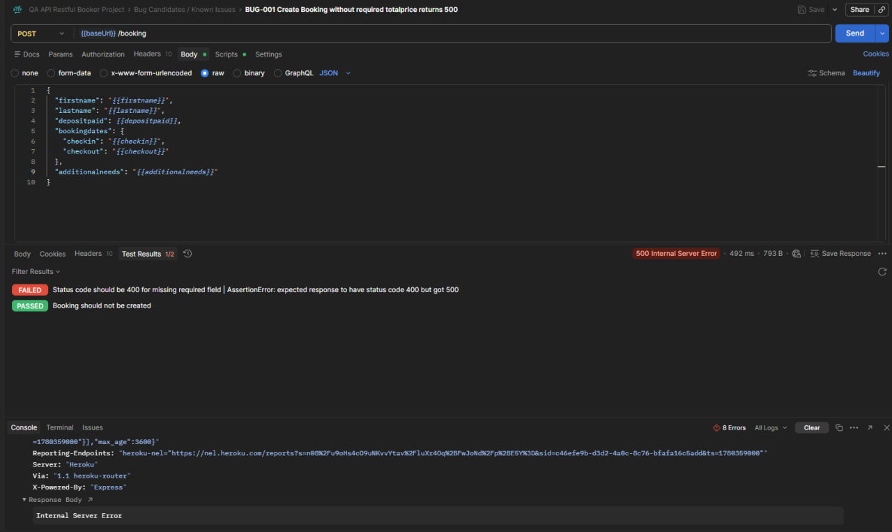
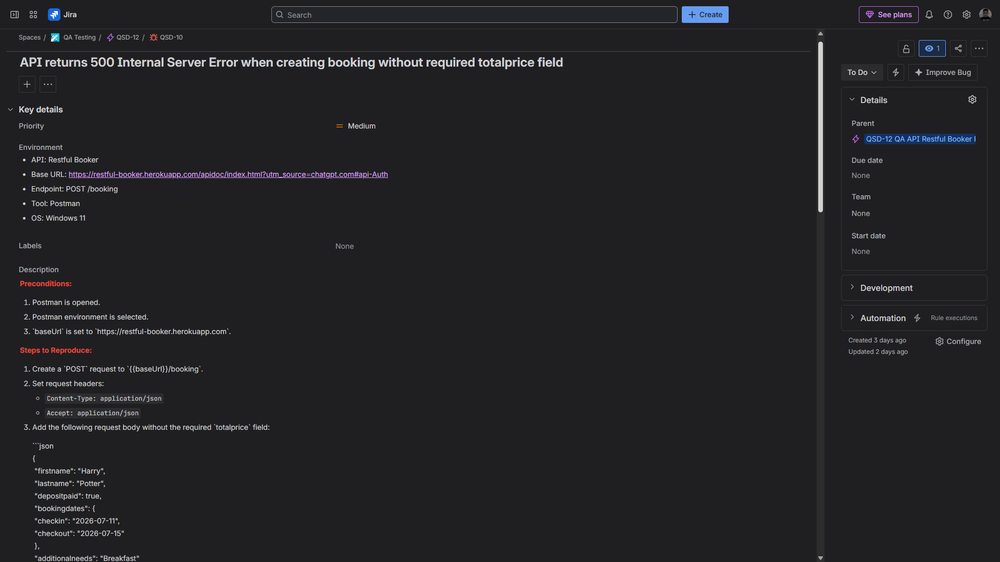

# Bug Report: API returns 500 Internal Server Error when creating booking without required `totalprice` field

**Bug ID:** BUG-001
**Severity:** Major
**Priority:** Medium
**Type:** API validation bug / Functional bug
**Related Test Case:** C328 — Create booking without required totalprice
**Jira Issue:** QSD-10

## Summary

When creating a booking without the required `totalprice` field, the API returns `500 Internal Server Error` instead of handling the request as a client-side validation error.

## Environment

* **Application:** Restful Booker API
* **API Documentation:** https://restful-booker.herokuapp.com/apidoc/index.html
* **Base URL:** https://restful-booker.herokuapp.com
* **Endpoint:** `POST /booking`
* **Tool:** Postman
* **OS:** Windows 11

## Preconditions

* Postman is opened.
* Postman environment is selected.
* `baseUrl` is set to `https://restful-booker.herokuapp.com`.

## Steps to Reproduce

1. Create a `POST` request to `{{baseUrl}}/booking`.

2. Set request headers:

   * `Content-Type: application/json`
   * `Accept: application/json`

3. Add the following request body without the required `totalprice` field:

```json
{
  "firstname": "Harry",
  "lastname": "Potter",
  "depositpaid": true,
  "bookingdates": {
    "checkin": "2026-07-11",
    "checkout": "2026-07-15"
  },
  "additionalneeds": "Breakfast"
}
```

4. Send the request.

## Expected Result

The API should return `400 Bad Request` with a clear validation error message indicating that the required `totalprice` field is missing.

## Actual Result

The API returns `500 Internal Server Error` instead of a client-side validation error.

## Notes

This indicates missing or incorrect server-side validation for required request body fields.

The booking is not created, but the returned status code is incorrect because the request error should be handled as a client-side validation issue, not as an internal server error.

## Attachment

Screenshot showing the request body without `totalprice` and the actual `500 Internal Server Error` response.



## Jira Evidence

**Jira Issue:** QSD-10
**Status:** To Do
**Priority:** Medium
**Parent:** QSD-12 — QA API Restful Booker Project




