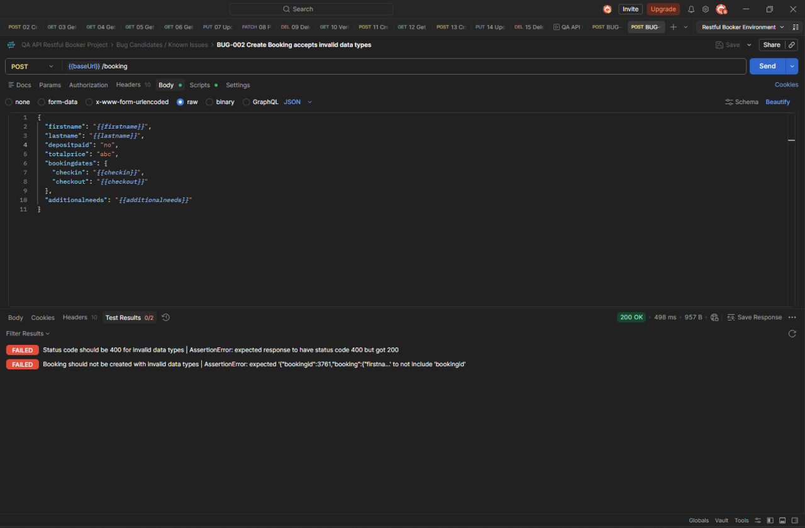
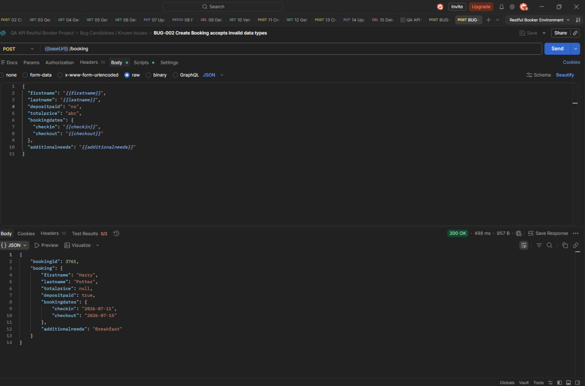
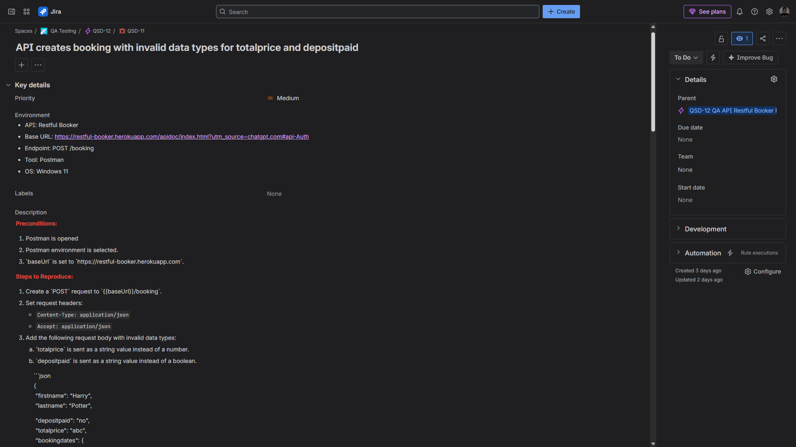
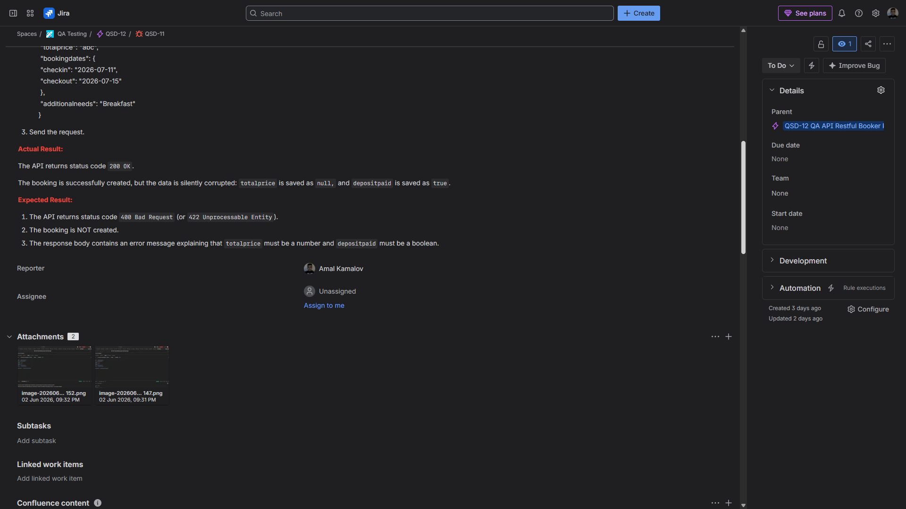

# Bug Report: API creates booking with invalid data types for `totalprice` and `depositpaid`

**Bug ID:** BUG-002
**Severity:** Major
**Priority:** Medium
**Type:** API validation bug / Functional bug
**Related Test Case:** C338 — Create Booking accepts invalid data types
**Jira Issue:** QSD-11

## Summary

The API successfully creates a booking when invalid data types are sent for `totalprice` and `depositpaid`.

The `totalprice` field is sent as a string instead of a number, and the `depositpaid` field is sent as a string instead of a boolean. Instead of rejecting the request, the API returns `200 OK` and creates a booking with corrupted data.

## Environment

* **Application:** Restful Booker API
* **API Documentation:** https://restful-booker.herokuapp.com/apidoc/index.html
* **Base URL:** https://restful-booker.herokuapp.com
* **Endpoint:** `POST /booking`
* **Tool:** Postman
* **OS:** Windows 11

## Preconditions

* Postman is opened.
* Postman environment is selected.
* `baseUrl` is set to `https://restful-booker.herokuapp.com`.

## Steps to Reproduce

1. Create a `POST` request to `{{baseUrl}}/booking`.

2. Set request headers:

   * `Content-Type: application/json`
   * `Accept: application/json`

3. Add the following request body with invalid data types:

   * `totalprice` is sent as a string value instead of a number.
   * `depositpaid` is sent as a string value instead of a boolean.

```json
{
  "firstname": "Harry",
  "lastname": "Potter",
  "totalprice": "abc",
  "depositpaid": "no",
  "bookingdates": {
    "checkin": "2026-07-11",
    "checkout": "2026-07-15"
  },
  "additionalneeds": "Breakfast"
}
```

4. Send the request.

## Expected Result

The API should reject the request and return a client-side validation error.

Expected behavior:

* The API returns `400 Bad Request` or `422 Unprocessable Entity`.
* The booking is not created.
* The response body contains a validation message explaining that:

  * `totalprice` must be a number.
  * `depositpaid` must be a boolean.

## Actual Result

The API returns `200 OK` and creates a booking.

The data is silently corrupted:

* `totalprice` is saved as `null`.
* `depositpaid` is saved as `true`.

## Notes

This is a data validation issue. The API accepts invalid request body values instead of rejecting them.

This may cause incorrect booking data to be stored because invalid values are converted silently instead of being validated.

## Attachments

Screenshot showing the request with invalid data types and the API returning `200 OK`.



Screenshot showing the created booking with corrupted values.



## Jira Evidence

**Jira Issue:** QSD-11
**Status:** To Do
**Priority:** Medium
**Parent:** QSD-12 — QA API Restful Booker Project




