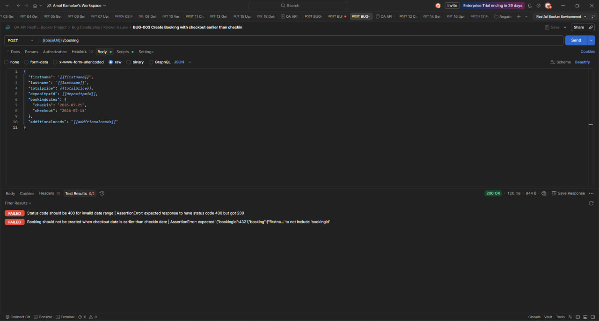
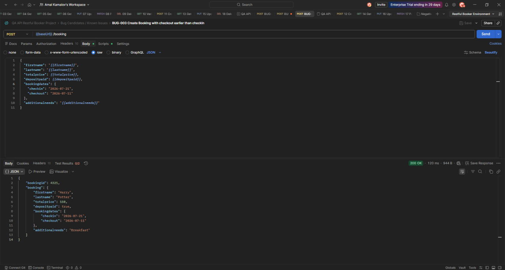
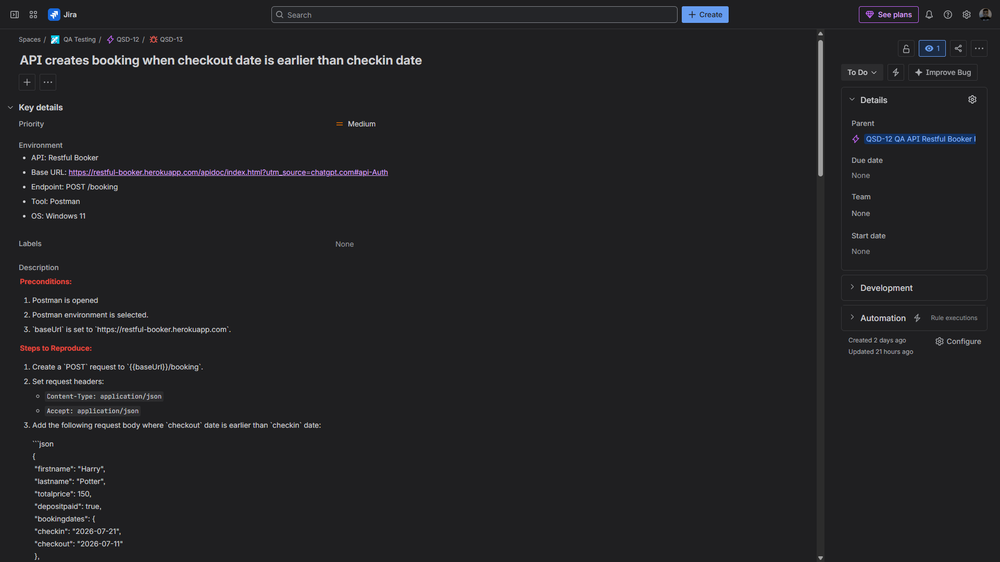
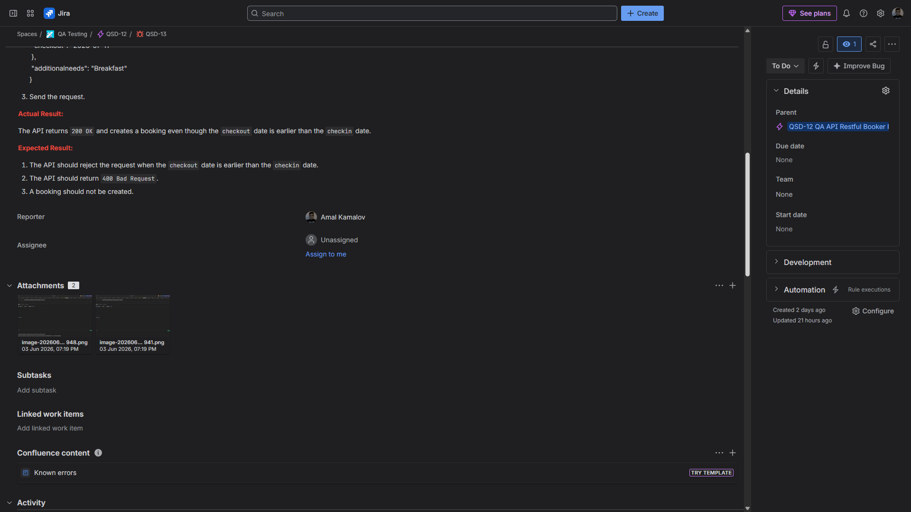

# Bug Report: API creates booking when checkout date is earlier than checkin date

**Bug ID:** BUG-003
**Severity:** Major
**Priority:** Medium
**Type:** API validation bug / Functional bug
**Related Test Case:** C329 — Create booking with checkout earlier than checkin
**Jira Issue:** QSD-13

## Summary

The API successfully creates a booking when the `checkout` date is earlier than the `checkin` date.

This is incorrect because a booking cannot logically end before it starts. The API should reject this request as invalid input.

## Environment

* **Application:** Restful Booker API
* **API Documentation:** https://restful-booker.herokuapp.com/apidoc/index.html
* **Base URL:** https://restful-booker.herokuapp.com
* **Endpoint:** `POST /booking`
* **Tool:** Postman
* **OS:** Windows 11

## Preconditions

* Postman is opened.
* Postman environment is selected.
* `baseUrl` is set to `https://restful-booker.herokuapp.com`.

## Steps to Reproduce

1. Create a `POST` request to `{{baseUrl}}/booking`.

2. Set request headers:

   * `Content-Type: application/json`
   * `Accept: application/json`

3. Add the following request body where `checkout` date is earlier than `checkin` date:

```json
{
  "firstname": "Harry",
  "lastname": "Potter",
  "totalprice": 150,
  "depositpaid": true,
  "bookingdates": {
    "checkin": "2026-07-21",
    "checkout": "2026-07-11"
  },
  "additionalneeds": "Breakfast"
}
```

4. Send the request.

## Expected Result

The API should reject the request because the `checkout` date is earlier than the `checkin` date.

Expected behavior:

* The API returns `400 Bad Request`.
* The booking is not created.
* The response body contains a validation message explaining that `checkout` date must be later than or equal to `checkin` date.

## Actual Result

The API returns `200 OK` and creates a booking even though the `checkout` date is earlier than the `checkin` date.

## Notes

This is a date validation issue. The API accepts logically invalid booking dates instead of rejecting the request.

As a result, the system can store bookings with impossible date ranges.

## Attachments

Screenshot showing the request body with invalid date range and the API returning `200 OK`.



Screenshot showing that the booking was created with `checkout` earlier than `checkin`.



## Jira Evidence

**Jira Issue:** QSD-13
**Status:** To Do
**Priority:** Medium
**Parent:** QSD-12 — QA API Restful Booker Project




