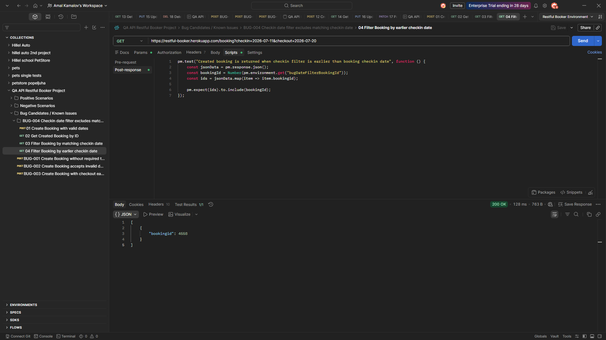
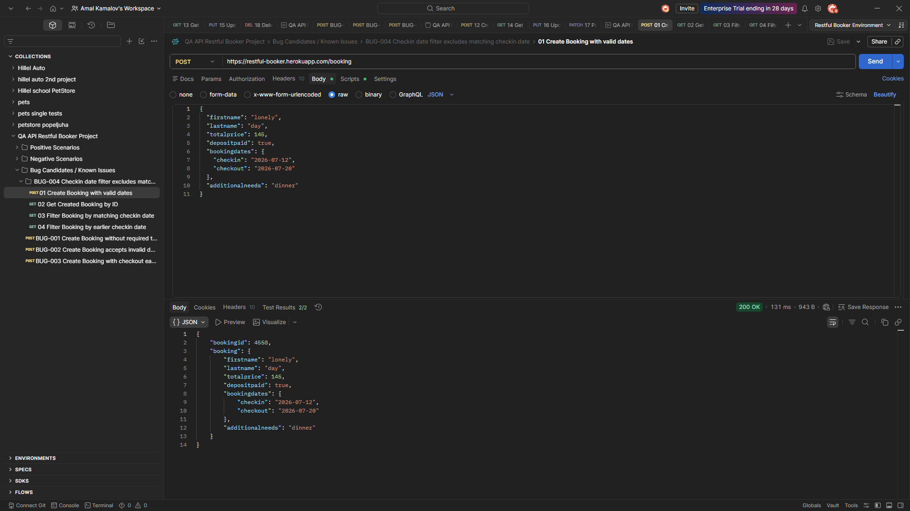
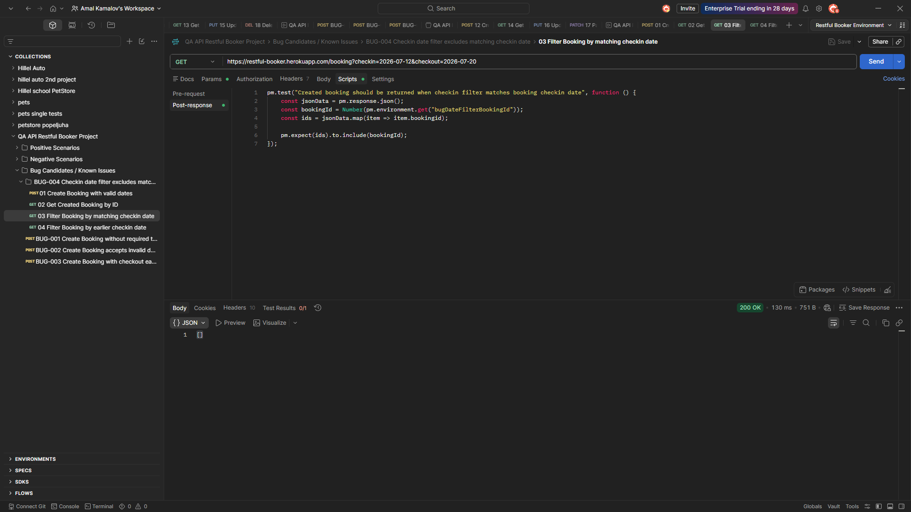
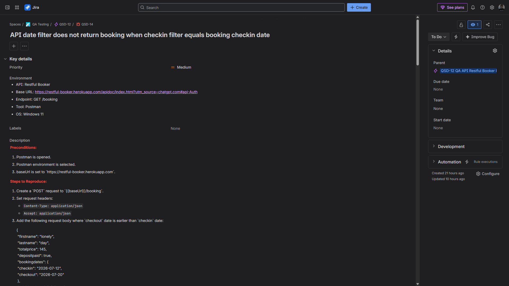
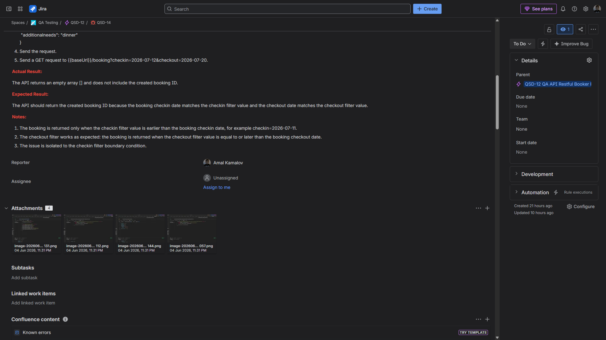

# Bug Report: API date filter does not return booking when checkin filter equals booking checkin date

**Bug ID:** BUG-004
**Severity:** Medium
**Priority:** Medium
**Type:** API filtering bug / Functional bug
**Related Test Case:** C339 — Verify booking is returned when checkin filter matches booking checkin date
**Jira Issue:** QSD-14

## Summary

The API does not return a created booking when the `checkin` filter value is equal to the booking's actual `checkin` date.

The booking is returned only when the `checkin` filter value is earlier than the booking `checkin` date. The issue is isolated to the `checkin` filter boundary condition.

## Environment

* **Application:** Restful Booker API
* **API Documentation:** https://restful-booker.herokuapp.com/apidoc/index.html
* **Base URL:** https://restful-booker.herokuapp.com
* **Endpoint:** `GET /booking`
* **Tool:** Postman
* **OS:** Windows 11

## Preconditions

* Postman is opened.
* Postman environment is selected.
* `baseUrl` is set to `https://restful-booker.herokuapp.com`.

## Steps to Reproduce

1. Create a `POST` request to `{{baseUrl}}/booking`.

2. Set request headers:

   * `Content-Type: application/json`
   * `Accept: application/json`

3. Add the following request body with valid booking dates:

```json
{
  "firstname": "lonely",
  "lastname": "day",
  "totalprice": 145,
  "depositpaid": true,
  "bookingdates": {
    "checkin": "2026-07-12",
    "checkout": "2026-07-20"
  },
  "additionalneeds": "dinner"
}
```

4. Send the request.

5. Save the returned `bookingid`.

6. Send a `GET` request to `{{baseUrl}}/booking/{bookingid}`.

7. Verify that the created booking exists and contains:

   * `checkin`: `2026-07-12`
   * `checkout`: `2026-07-20`

8. Send a `GET` request using the same checkin and checkout dates:

```text
{{baseUrl}}/booking?checkin=2026-07-12&checkout=2026-07-20
```

9. Observe the response body.

10. Send another `GET` request with the `checkin` filter one day earlier:

```text
{{baseUrl}}/booking?checkin=2026-07-11&checkout=2026-07-20
```

11. Compare both responses.

## Expected Result

The API should return the created booking ID when the booking date matches the provided filter values.

Expected behavior:

* The booking is returned when `checkin=2026-07-12`.
* The booking is returned when `checkout=2026-07-20`.
* The created booking ID is included in the filtered response.

## Actual Result

The API returns an empty array `[]` when the `checkin` filter value is equal to the booking `checkin` date.

The created booking ID is returned only when the `checkin` filter value is earlier than the booking `checkin` date, for example:

```text
checkin=2026-07-11
```

## Notes

The issue is isolated to the `checkin` filter boundary condition.

Observed behavior:

* `checkin=2026-07-12` returns `[]`.
* `checkin=2026-07-11` returns the created booking ID.
* The `checkout` filter works as expected: the booking is returned when the checkout filter value is equal to or later than the booking checkout date.

This suggests that the `checkin` filter uses strict greater-than logic instead of greater-than-or-equal logic.

## Attachments

Screenshot showing the booking creation request and response.


Screenshot showing the created booking retrieved by ID.



Screenshot showing that the matching checkin date filter returns an empty array.



Screenshot showing that an earlier checkin date filter returns the created booking ID.



## Jira Evidence

**Jira Issue:** QSD-14
**Status:** To Do
**Priority:** Medium
**Parent:** QSD-12 — QA API Restful Booker Project




