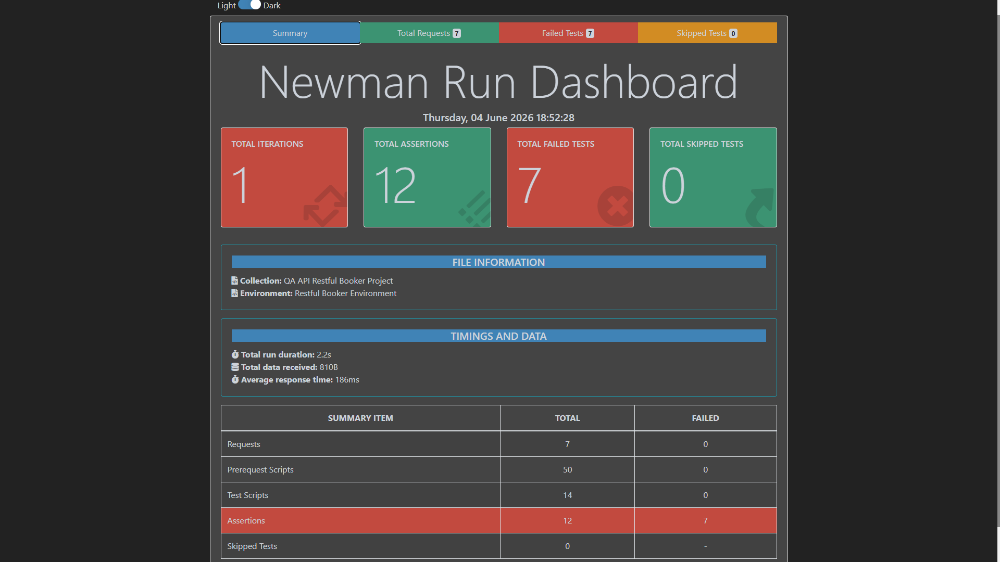
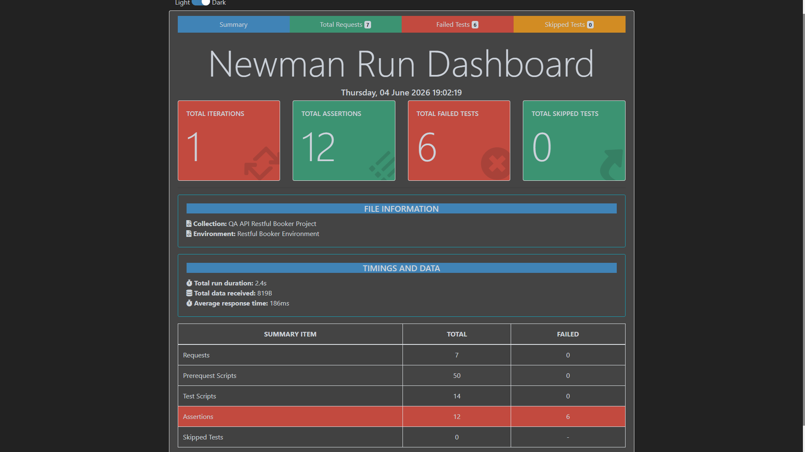
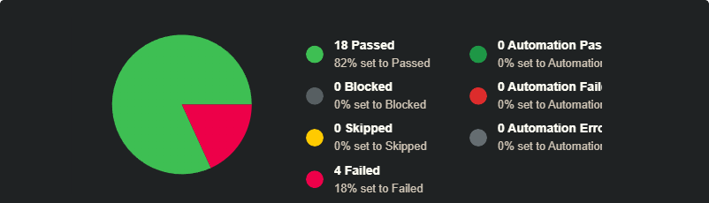

# QA API Testing Project – Restful Booker

## 📌 Project Overview

This is a manual API testing project for the **Restful Booker API**, a demo REST API for booking management.

The project covers authentication, booking CRUD operations, filtering, authorization checks, negative API scenarios, automated Postman assertions, Newman test runs, TestRail execution, and documented API defects.

It demonstrates practical skills in API testing, test analysis, test case creation, Postman collection design, environment variables, automated assertions, bug reporting, and test documentation.

## 🧪 Scope of Testing

The scope of testing covers the main Restful Booker API functionality:

* Authentication
* Booking creation
* Booking retrieval
* Booking filtering
* Full booking update
* Partial booking update
* Booking deletion
* Positive API scenarios
* Negative API scenarios
* Authorization checks
* Response status code validation
* Response body validation
* Bug evidence scenarios

The tested endpoints include:

| Feature                | Method | Endpoint        |
| ---------------------- | ------ | --------------- |
| Create token           | POST   | `/auth`         |
| Get booking IDs        | GET    | `/booking`      |
| Get booking by ID      | GET    | `/booking/{id}` |
| Create booking         | POST   | `/booking`      |
| Update booking         | PUT    | `/booking/{id}` |
| Partial update booking | PATCH  | `/booking/{id}` |
| Delete booking         | DELETE | `/booking/{id}` |

## 🛠 Testing Types Used

* Functional API testing
* Positive testing
* Negative testing
* Authorization testing
* CRUD testing
* Data validation testing
* Response body validation
* Status code validation
* Bug evidence testing
* Basic response time checks

## 🧰 Technologies & Tools Used

* **Postman** — API requests, environment variables, collection variables, automated assertions
* **Newman** — CLI collection execution and HTML reports
* **TestRail** — test case management and test execution
* **Jira** — bug reporting practice
* **GitHub** — project repository and documentation storage

## 📂 Project Structure

**qa-api-restful-booker-project**

* **README.md**
* **[01-test-analysis](01-test-analysis/)** — test analysis, scope, risks, test data, acceptance criteria
* **[02-postman](02-postman/)** — Postman collection, environment, and run instructions
* **[03-test-cases](03-test-cases/)** — API test cases grouped by endpoint area
* **[04-test-runs](04-test-runs/)** — Newman reports, TestRail run results, screenshots
* **[05-bug-reports](05-bug-reports/)** — documented API defects with Jira evidence
* **[06-checklists](06-checklists/)** — API testing checklist and coverage overview

## 🧾 Test Artifacts

* **Test Analysis** — scope, endpoints, test data, risks, and acceptance criteria.
* **Postman Collection** — positive, negative, and bug-related API scenarios.
* **Postman Environment** — base URL and runtime variables.
* **API Test Cases** — detailed test cases with preconditions, steps, expected results, priority, and type.
* **Checklist** — quick coverage overview for Auth, GET, POST, PUT, PATCH, DELETE, authorization, response validation, and bug evidence.
* **Newman Main Run Report** — green run for positive and negative API scenarios.
* **Newman Bug Evidence Run Report** — separate run for known bug evidence scenarios.
* **TestRail Run Results** — exported test execution results with passed/failed status and linked Jira defects.
* **Bug Reports** — defects documented with steps, actual result, expected result, priority, Jira ID, and screenshots.

## 🌐 Test Environment

* **API:** Restful Booker API
* **API Documentation:** https://restful-booker.herokuapp.com/apidoc/index.html
* **Base URL:** https://restful-booker.herokuapp.com
* **Tool:** Postman
* **CLI Runner:** Newman
* **Test Management:** TestRail
* **Bug Tracking:** Jira
* **OS:** Windows 11

## ▶️ How to Run Postman Collection

1. Import the Postman collection from [`02-postman`](02-postman/).
2. Import the Postman environment file.
3. Select `Restful Booker Environment`.
4. Run `Positive Scenarios` and `Negative Scenarios` for the main test run.
5. Run `Bug Candidates / Known Issues` separately for bug evidence.

### Run via Newman CLI

```bash
newman run restful-booker-api-tests.postman_collection.json -e restful-booker-environment.postman_environment.json
```

To generate an HTML report:

```bash
newman run restful-booker-api-tests.postman_collection.json -e restful-booker-environment.postman_environment.json -r htmlextra
```

## 📊 Test Execution Results

### Newman Main Run

The main Newman run includes positive and negative API scenarios without known bug evidence requests.

| Metric           | Count |
| ---------------- | ----: |
| Total requests   |    18 |
| Total assertions |    62 |
| Failed tests     |     0 |
| Skipped tests    |     0 |



[Full Newman Main Run Report](04-test-runs/newman-test-run/newman-main-run-report.html)

### Newman Bug Evidence Run

The bug evidence run includes requests from the `Bug Candidates / Known Issues` folder.

Failed assertions are expected because these tests validate correct expected behavior against known API defects.

| Metric           | Count |
| ---------------- | ----: |
| Total requests   |     7 |
| Total assertions |    12 |
| Failed tests     |     6 |
| Skipped tests    |     0 |



[Full Newman Bug Evidence Report](04-test-runs/newman-test-run/newman-bug-evidence-report.html)

### TestRail Run

A full API test run was executed in TestRail.

| Status    |  Count | Percentage |
| --------- | -----: | ---------: |
| Passed    |     18 |        82% |
| Failed    |      4 |        18% |
| Blocked   |      0 |         0% |
| Skipped   |      0 |         0% |
| **Total** | **22** |   **100%** |



[Test Run Summary](04-test-runs/test-run-summary.md)
[TestRail Run Results CSV](04-test-runs/testrail-test-run/testrail-run-results.csv)
[TestRail Run Stats CSV](04-test-runs/testrail-test-run/testrail-run-stats.csv)

## 🐞 Defects Found

| Bug ID                                                                                                                             | Summary                                                                                           | Severity | Priority | Related Test Case | Jira Issue |
| ---------------------------------------------------------------------------------------------------------------------------------- | ------------------------------------------------------------------------------------------------- | -------- | -------- | ----------------- | ---------- |
| [BUG-001](05-bug-reports/BUG-001-missing-totalprice-returns-500/BUG-001-missing-totalprice-returns-500.md)                         | API returns `500 Internal Server Error` when creating booking without required `totalprice` field | Major    | Medium   | C328              | QSD-10     |
| [BUG-002](05-bug-reports/BUG-002-invalid-data-types-accepted/BUG-002-invalid-data-types-accepted.md)                               | API creates booking with invalid data types for `totalprice` and `depositpaid`                    | Major    | Medium   | C338              | QSD-11     |
| [BUG-003](05-bug-reports/BUG-003-checkout-earlier-than-checkin-accepted/BUG-003-checkout-earlier-than-checkin-accepted.md)         | API creates booking when checkout date is earlier than checkin date                               | Major    | Medium   | C329              | QSD-13     |
| [BUG-004](05-bug-reports/BUG-004-checkin-date-filter-excludes-matching-date/BUG-004-checkin-date-filter-excludes-matching-date.md) | API date filter does not return booking when checkin filter equals booking checkin date           | Medium   | Medium   | C339              | QSD-14     |

[Bug Reports](05-bug-reports/)

## ⚠️ Limitations

* Database testing was not performed because database access is not available.
* Security penetration testing was not included.
* Performance/load testing was not included.
* Automation framework implementation was not included.
* Testing was focused on API behavior available through the public Restful Booker endpoints.
* Some failed assertions are expected in bug evidence runs because they demonstrate documented API defects.

## 👤 Author

**Amal Kamalov**
Manual QA Junior/Trainee
